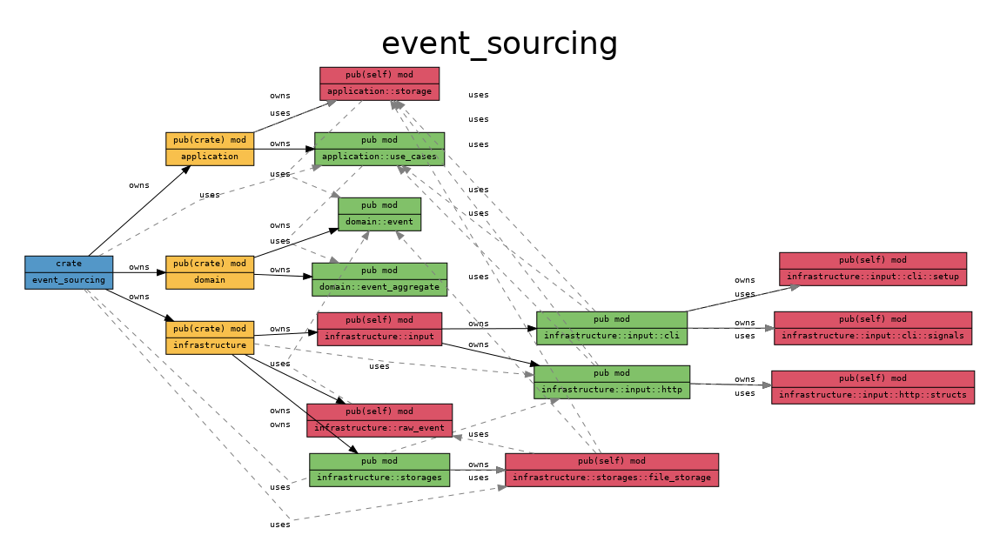
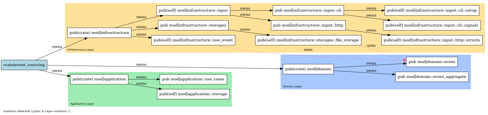

# DOT Graph Layered Transformation Tool

## Overview

This project provides a Python script to transform DOT-format diagrams into a cleaner, layered visualization.  
It was designed specifically for projects structured according to **Clean Architecture** or **Clean Code** principles.

The tool groups nodes into three layers — `domain`, `application`, and `infrastructure` — and adjusts edges to show only the most meaningful relationships:

- **`owns`** edges from the root node to layers.
- **`uses`** edges between different layers.
- **`owns`** edges within the same layer.

This helps keep diagrams clean, maintainable, and readable, especially for complex systems.

---

## Requirements

- Python 3.7 or higher

---

## Usage

1. **Make the script executable** (optional):

    ```bash
    chmod +x transform.py
    ```

2. **Run the script**:

    ```bash
    ./transform.py path/to/input.dot path/to/output.dot
    ```

    or using Python directly:

    ```bash
    python3 transform.py path/to/input.dot path/to/output.dot
    ```

- `input.dot` — the original DOT file describing your system.
- `output.dot` — the path where the transformed DOT file will be saved.

---

## Features

- **Automatic Layer Detection**  
  Nodes are assigned to `domain`, `application`, or `infrastructure` layers based on the presence of these names in their identifiers.

- **Clustered Layout**  
  Each layer is visually separated into its own `subgraph cluster` with rounded borders.

- **Filtered Relationships**  
  Only meaningful edges are preserved:
  - **From root to layer:** only `owns` edges.
  - **Between layers:** only `uses` edges (optionally dashed).
  - **Inside a layer:** only internal `owns` edges.

- **Flexible Project Names**  
  The script is not tied to any specific root node name or project structure beyond the three layers.

---

## Example

Here’s a real-world example of how this tool can be used in a project.

### 1. Generate the initial DOT diagram

I used [`cargo-modules`](https://github.com/regexident/cargo-modules) to generate a DOT file from a Rust project:

```bash
cargo modules dependencies --package <PACKAGE-NAME> --bin <PACKAGE-NAME>  --no-externs --no-sysroot --no-fns --no-traits --no-types  --layout dot > graph.dot
```

### 2. Create a PNG image from the original DOT

Using the Graphviz dot utility, I generated an initial diagram for visualization:

```bash
dot -Tpng graph.dot -o before_transformation.png
```

The result was a messy, dense graph — hard to read and understand.

### 3. Transform the DOT file

I applied the transform.py script to clean and structure the graph:

```bash
python3 transform.py graph.dot graph_transformed.dot
```

This reorganized nodes into clean clusters for domain, application, and infrastructure layers and removed unnecessary edges.

### 4. Generate the transformed PNG image

Finally, I created a new PNG image from the transformed DOT file:

```bash
dot -Tpng graph_transformed.dot -o after_transform.png
```

The final result was a much cleaner, layered diagram — easy to navigate and understand the structure of the project.

### Before Transformation



### After Transformation


